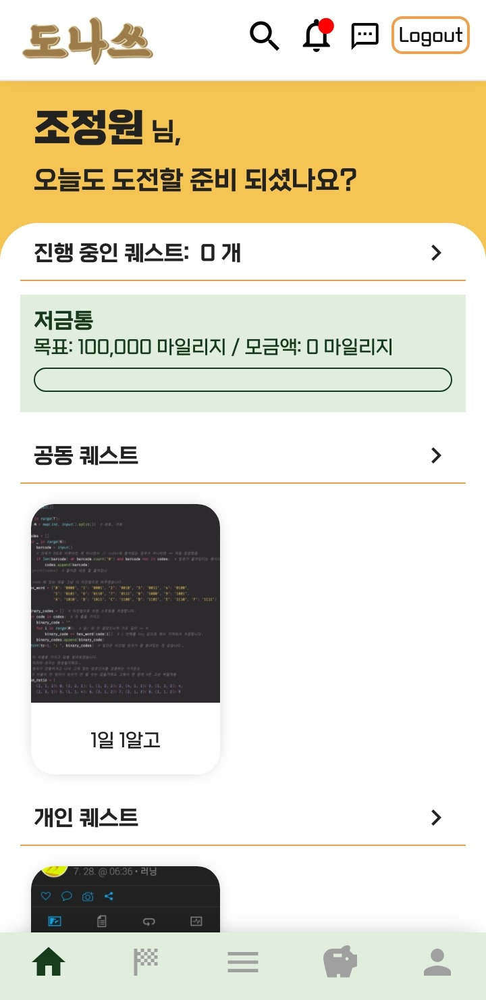
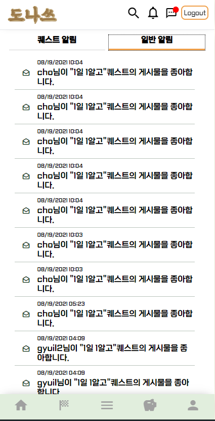
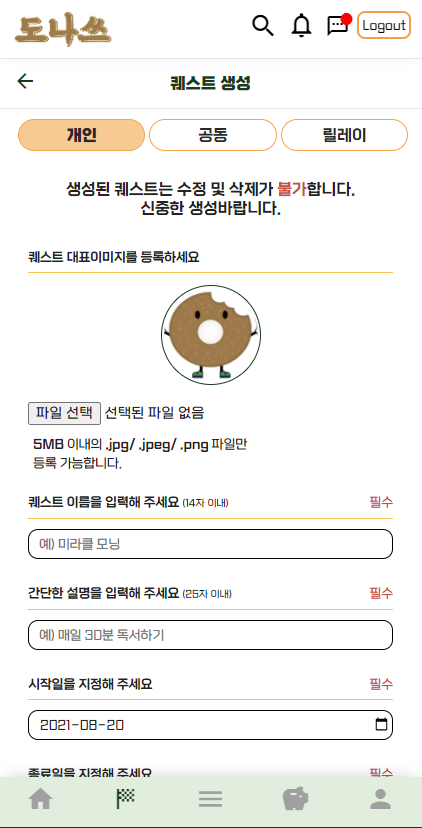
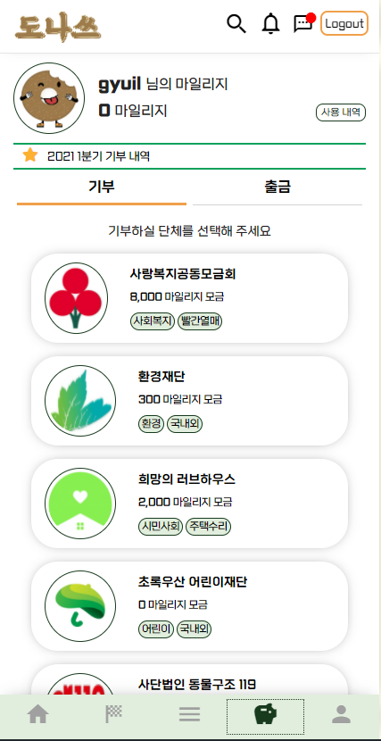
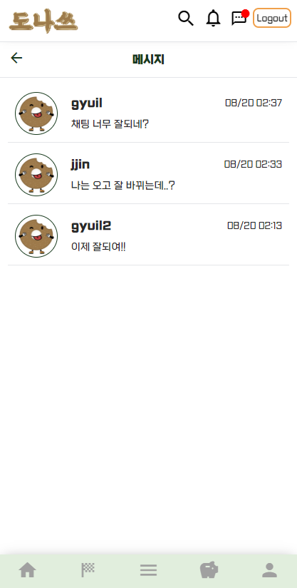
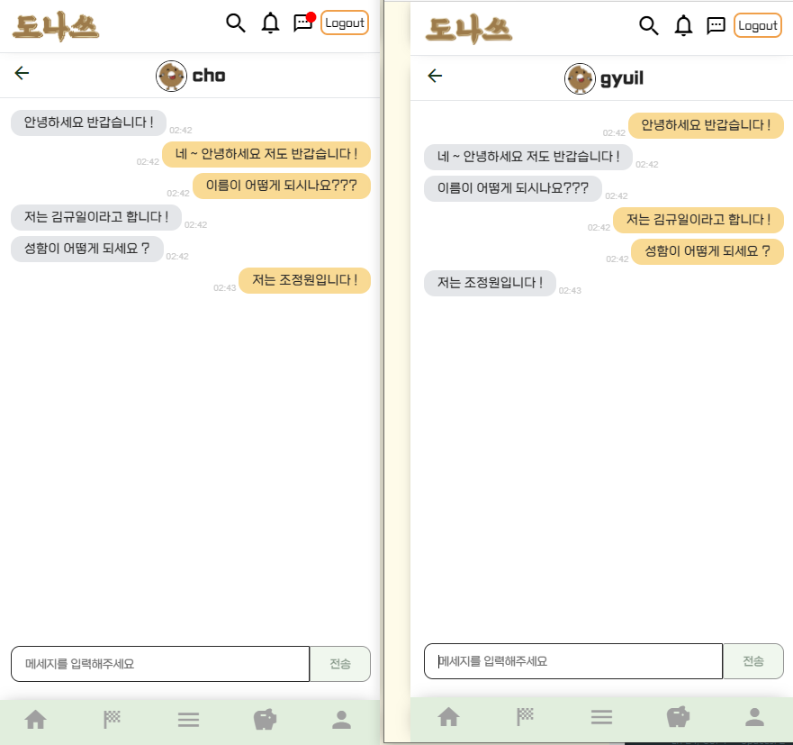
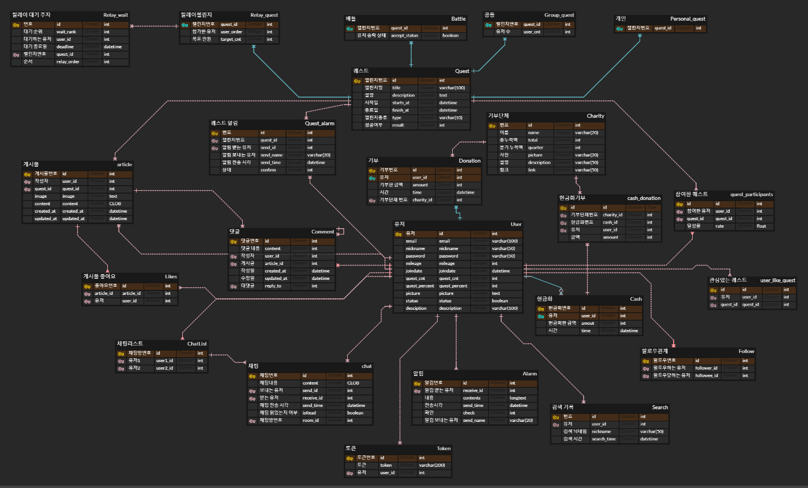

2학기 공통 프로젝트
=================

## :fire: DONAS 소개
- 도전(DO) + 나눔(NA) ' S
- 원하는 목표를 함께 달성하고 이를 통해 기부를 실천할 수 있는 SNS
- 개인 , 공동 , 릴레이 퀘스트

## :white_check_mark: 개발환경
```
Front-End
1. 

Back-End
1. 개발 IDE - Spring Tool Suit 3
2. MySQL - MySQL 8.0
```

## :white_check_mark: 기본 UI

- 메인 페이지 / 프로필 / 알림창

<br>






<br>

#

- 퀘스트 리스트 / 퀘스트 생성페이지 / 기부단체

<br>





<br>

#

- 채팅 페이지 / 채팅 시뮬

<br>





## :boom: ER DIAGRAM



## 개발 과정
1. 프로젝트 구상
2. 기능 명세
(https://docs.google.com/spreadsheets/d/1zouxSlsZXX9zNurkMBaZsU4JgsocsY-zZhKlbs8CJIw/edit#gid=0)
3. DB 설계
(https://www.erdcloud.com/d/qpmHGSwazXjGzabCd)
4. REST API Query (https://docs.google.com/spreadsheets/d/12EH5Twx_H4F5ZXwWWNIza8_HUWE6dTmytOEXz1Z-Z_w/edit#gid=0)
5. Front-End : Vue.js, PWA 구현 / Back-End : MVC PATTERN , JPA 구현
-> Firebase Cloud Message(FCM)을 활용한 실시간 알림, 채팅 개발

