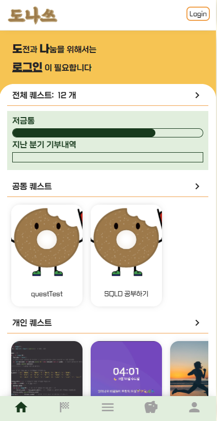
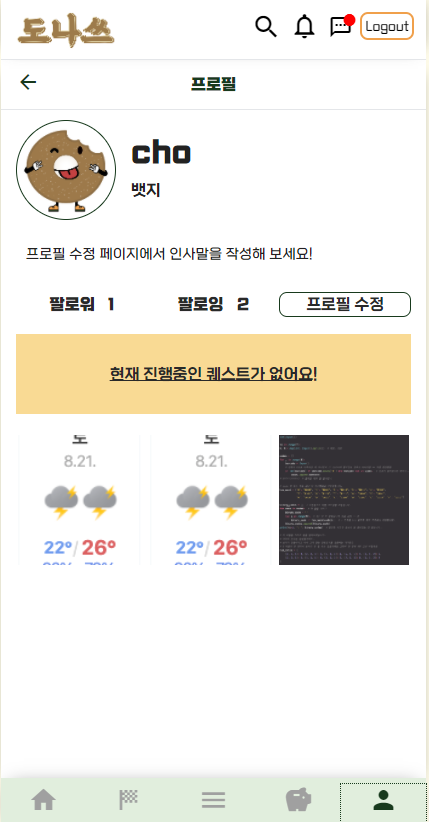
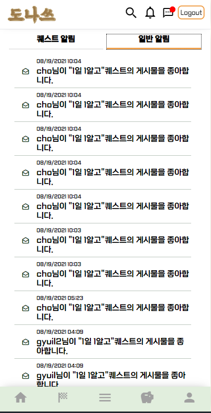

2학기 공통 프로젝트
=================

## :fire: DONAS 소개
- 도전(DO) + 나눔(NA) ' S
- 원하는 목표를 함께 달성하고 이를 통해 기부를 실천할 수 있는 SNS
- 개인 , 공동 , 릴레이 퀘스트

## :white_check_mark: 개발환경
```
Front-End
1. 

Back-End
1. 개발 IDE - Spring Tool Suit 3
2. MySQL - MySQL 8.0
```

## :white_check_mark: 기본 UI

- 메인 페이지 / 프로필 / 알림창

<br>

 



<br>

#

- 퀘스트 리스트 / 퀘스트 생성페이지 / 기부단체

<br>


<br>

#

- 채팅 페이지 / 채팅 시뮬

<br>


## :boom: ER DIAGRAM


## 


